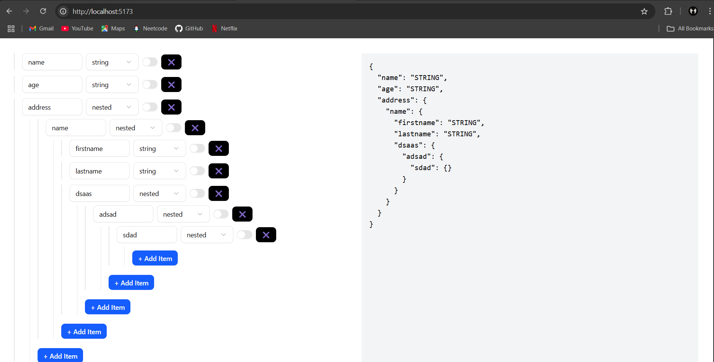

# 🧩 JSON Schema Builder

A dynamic and extensible form builder built with **React**, **TypeScript**, **React Hook Form**, and **shadcn/ui**, allowing users to interactively construct nested JSON schema definitions. It supports recursive nesting, field type selection, and live schema preview generation.

---

## ✨ Features

- 🧱 Add, edit, and remove schema fields
- 🔁 Support for nested (recursive) schema structures
- ⚙️ Field types: `string`, `number`, `nested`
- 📦 Live JSON preview output
- 🪝 Built using `react-hook-form` for efficient form handling
- 💅 Styled with `Tailwind CSS` and `shadcn/ui` components

---

## 📸 Demo Screenshot



---

## 🧪 Tech Stack

| Tech               | Purpose                           |
|--------------------|------------------------------------|
| React + TypeScript | Frontend with strict typing        |
| react-hook-form    | Form state and dynamic fields      |
| Tailwind CSS       | Utility-first styling              |
| shadcn/ui          | Accessible UI components           |
| uuid               | Unique field identifiers           |

---

## 🚀 Getting Started

### 1. Clone the repo
```bash
git clone https://github.com/jisangeorgekutty/HROne-Frontend-Task.git
cd json-schema-builder
```
### 2. Install dependencies
```bash
npm install
# or
yarn install
```
### 3. Run the app
```bash
npm run dev
# or
yarn dev
```

